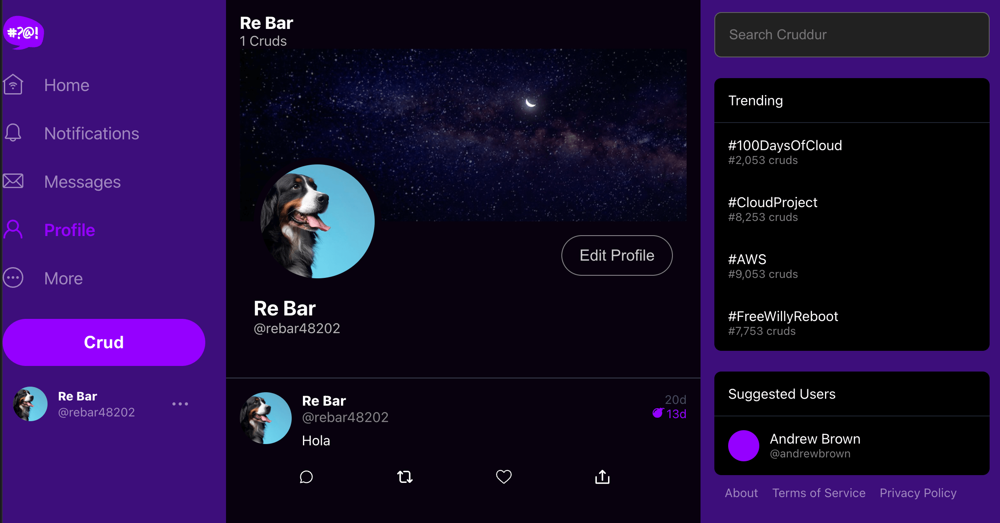
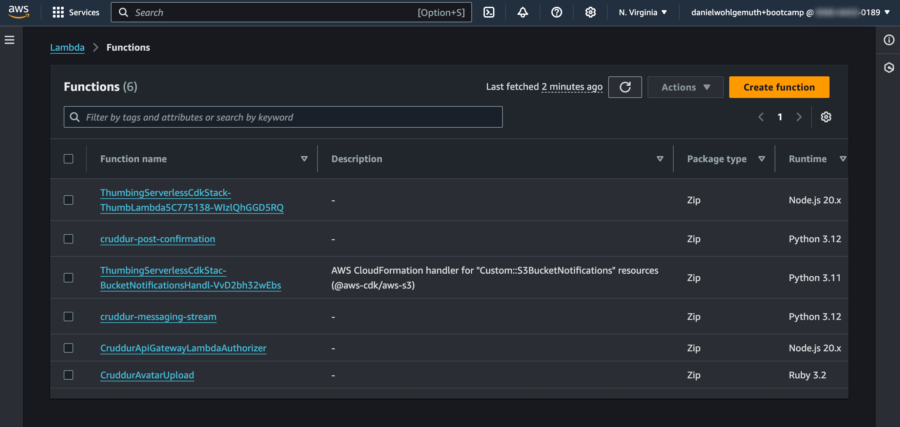
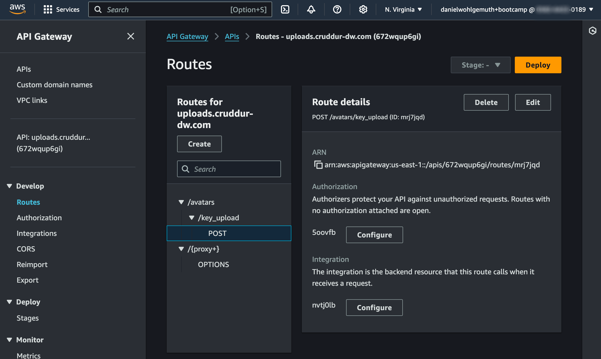
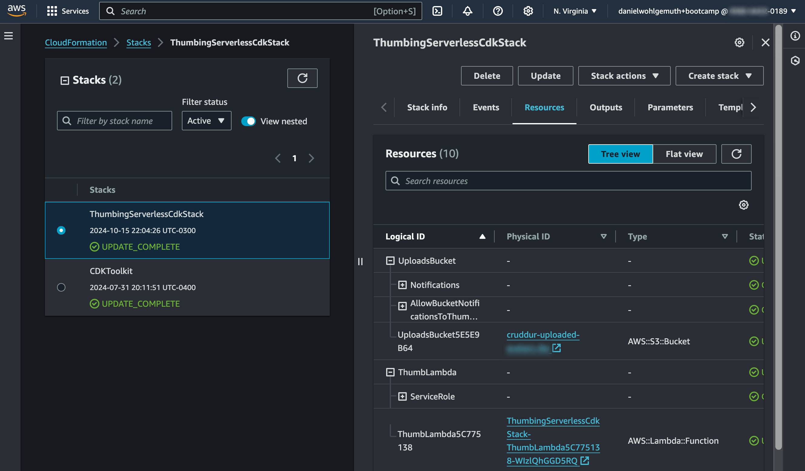
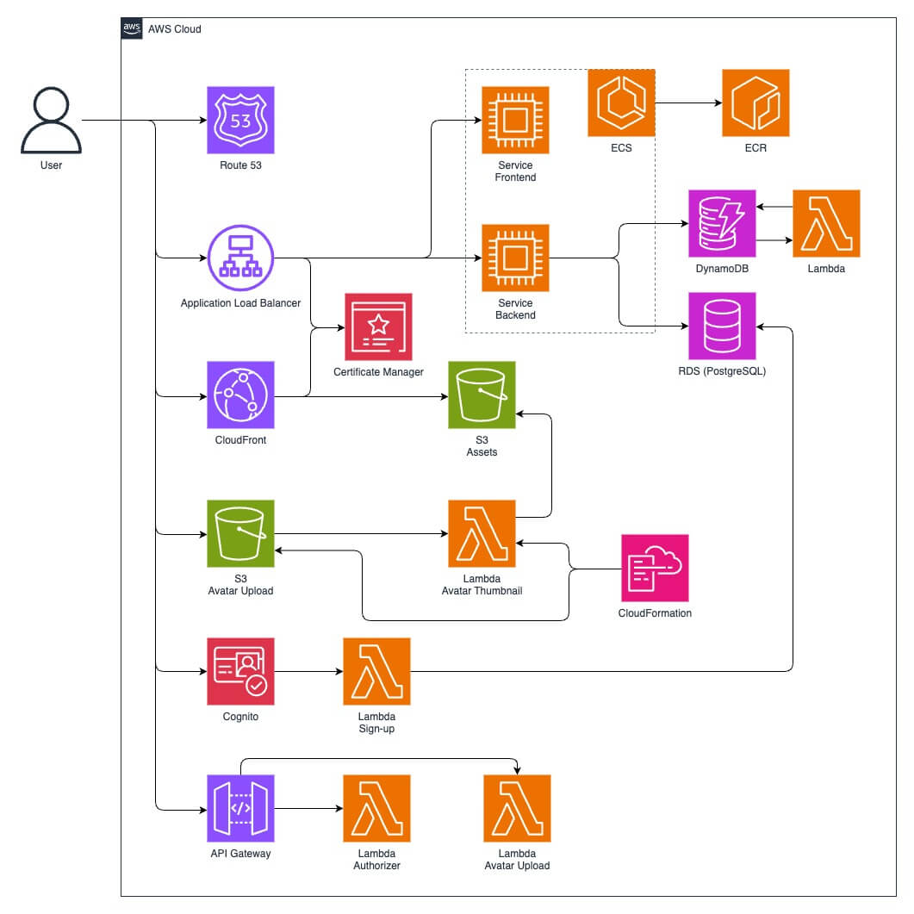

# Week 8 — Serverless Image Processing

## Profile Picture Upload

In week 8, the focus was the profile picture upload. To accomplish this, 3 Lambda functions were added and 2 S3 buckets were created. API Gateway was introduced to handle the upload of pictures. AWS Cloud Development Framework (CDK) was used to define part of the cloud infrastructure in code and provision it through AWS CloudFormation. CloudFront was configured to serve the processed pictures from one of the S3 buckets.

Here is the final result with the profile picture upload working.



The profile picture upload process involved 4 steps:
1. Get a pre-signed URL.
2. Upload the profile picture to an S3 bucket using the pre-signed URL.
3. Process the uploaded profile picture to have it in a consistent format.
4. Upload the processed picture to another S3 bucket for use on the site.

To generate the pre-signed URL, 2 Lambda functions were added: one to validate the session data (`CruddurApiGatewayLambdaAuthorizer`) and another to return the pre-signed URL (`CruddurAvatarUpload`).

To get the profile picture into a consistent format another Lambda function (`...ThumbLambda...`) was created, using the [sharp](https://www.npmjs.com/package/sharp) library to handle the image manipulation. The weird name of the functions comes from it being handled by CDK.

The CDK framework also added it's own Lambda function which is not considered here.



API Gateway was used to route the profile upload traffic to the `CruddurApiGatewayLambdaAuthorizer` Lambda for session verification and to the `CruddurAvatarUpload` Lambda to generate the pre-signed URL.



With [AWS CDK](https://aws.amazon.com/cdk/) using JavaScript (alternatives are Python, Java, C#, and Go), the `...ThumbLambda...` Lambda and the S3 bucket for the profile picture uploads were created using code instead of manually or through the CLI.



### AWS Architecture After Week 8



[AWS Architecture diagram file](https://app.diagrams.net/?title=Cruddur%20AWS%20Architecture#Uhttps%3A%2F%2Fraw.githubusercontent.com%2Fdanielwohlgemuth%2Faws-bootcamp-cruddur%2F26ec49bb58344e8704d5c6ac6193946afa669458%2Fjournal%2Fassets%2Fweek8%2Faws-architecture-diagram.drawio&title=Cruddur%20AWS%20Architecture)

## Cost Breakdown

There are a few services that add to the monthly cost by simply using them. This is an attempt at getting more familiar with AWS pricing by estimating the cost of running all service continuosly for a month.

### Elastic Container Service - Fargate (17.77 USD)
2 tasks x 0.25 vCPU x 720 hours x 0.04048 USD per hour = 14.57 USD for vCPU hours
2 tasks x 0.50 GB x 720 hours x 0.004445 USD per GB per hour = 3.20 USD for GB hours
14.57 USD for vCPU hours + 3.20 USD for GB hours = 17.77 USD

### Amazon Route 53 HostedZone (0.50 USD)
1 x 0.50 USD per Hosted Zone = 0.50 USD

### Virtual Private Cloud - Public IPv4 Addresses (14.60 USD)
4 x 720 hours in a month x 0.005 USD per in-use public IPv4 address = 14.40 USD

### Monthly Cost (32.87 USD)

Cost | Service
---: | :---
17.77 USD | Elastic Container Service - Fargate
0.50 USD | Amazon Route 53 HostedZone
14.40 USD | Virtual Private Cloud - Public IPv4 Addresses
**32.67 USD** | **Total**

Although the estimated cost is 32.67 USD, the actual cost is kept around 1 USD by stopping the ECS services and the RDS database. 

## JMESPath

One technology I explored a bit more this week was [JMESPath](https://jmespath.org/). It's a query language for JSON and is used when writing the expression for the `--query` parameter of the AWS CLI.

To give an idea on how it works, here is an example JSON and below it are a few JMESPath expressions followed by the result of each expression.

```
{
    "foo": {
        "bar": [
            "one",
            "two"
        ],
        "foobar": [
            {
                "name": "three" 
            },
            {
                "name": "four"
            }
        ]
    }
}
```

- `foo.bar[0]` -> `one`
- `foo.bar[?@ == "two"]` -> `two`
- `foo.foobar[?name == "three"].name` -> `three`

JMESPath is useful when writing simple scripts to extract specific information from the CLI result, like the ARN of a resource, and pass it to the next command.

## Useful Scripts to Set Up the Project

In order to make development easier or to keep AWS costs down, there are a growing number of scripts that have been added to the [scripts (bin)](/bin) folder of the project. Here are a few of the most useful commands at this point.

Setup local environment

```bash
./bin/bootstrap
```

Deploy CDK

```bash
./bin/cdk/deploy
```

Setup ALB

```bash
./bin/alb/setup
```

Create backend service

```bash
./bin/backend/create-service
```

Update backend service

```bash
./bin/backend/build
./bin/backend/push
./bin/backend/deploy
```

Create frontend service

```bash
./bin/frontend/create-service
```

Update frontend service

```bash
./bin/frontend/build
./bin/frontend/push
./bin/frontend/deploy
```

Start RDS

```bash
./bin/rds/start
```

Cleanup environment

```bash
./bin/frontend/delete-service
./bin/backend/delete-service
./bin/alb/delete
./bin/rds/stop
./bin/git/replace-secret-values-with-placeholders
```
